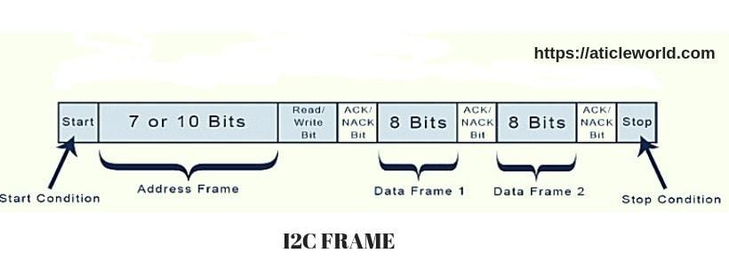
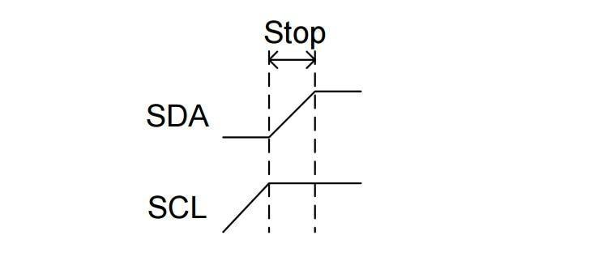
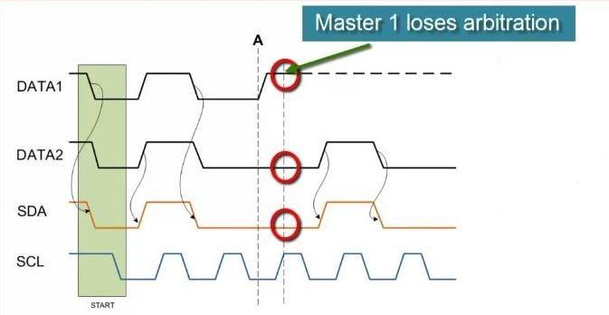

### URL lists

https://aticleworld.com/i2c-interview-questions/

[What is I2C in simple terms? Where do we use this protocol? Why would most SOCs have I2C protocol?](https://www.quora.com/What-is-I2C-in-simple-terms-Where-do-we-use-this-protocol-Why-would-most-SOCs-have-I2C-protocol)

### In-Depth I2C questions

***Q: Explain the physical layer of the I2C protocol***

***Answer:***

I2C is pure master and slave communication protocol, it can be the multi-master or multi-slave but we generally see a single master in I2C communication. In I2C only two-wire are used for communication, one is data bus (SDA) and the second one is the clock bus (CLK).

All slave and master are connected with same data and clock bus, here important thing is to remember these buses are connected to each other using the WIRE-AND configuration which is done by to putting both pins is open drain. The wire-AND configuration allows in I2C to connect multiple nodes to the bus without any short circuits from signal contention.

The open-drain allows the master and slave to drive the line low and release to high impedance state. So In that situation, when master and slave release the bus, need a pull resistor to pull the line high. The value of the pull-up resistor is very important as per the perspective of the design of the I2C system because the incorrect value of the pull-up resistor can lead to signal loss.

Note: We know that I2c communication protocol supports multiple masters and multiple slaves, but most system designs include only one master.

***Question: Explain the operation and frame of I2C protocol***

***Answer:***

I2C is a  chip to chip communication protocol. In I2C, communication is always started by the master. When the master wants to communicate with slave then he asserts a start bit followed by the slave address with read/write bit.

After asserting the start bit, all slave comes in the attentive mode. If the transmitted address match with any of the slave on the bus then an ACKNOWLEDGEMENT (ACK) bit is sent by the slave to the master.

After getting the ACK bit, master starts the communication. If there is no slave whose address match with the transmitted address then master received a NOT-ACKNOWLEDGEMENT (NACK) bit, in that situation either master assert the stop bit to stop the communication or assert a repeated start bit on the line for new communication.

When we send or receive the bytes in i2c, we always get a NACK bit or ACK bit after each byte of the data is transferred during the communication.

In I2C, one bit is always transmitted on every clock. A byte which is transmitted in I2C could be an address of the device, the address of register or data which is written to or read from the slave.

In I2C, SDA line is always stable during the high clock phase except for the start condition, stop condition and repeated start condition. The SDA line only changes their state during the low clock phase.

See the below image,

***Question: What is START bit and STOP bit?***

***Answer:***

**Start Condition**:
The default state of SDA and SCL line is high. A master asserts the start condition on the line to start the communication. A high to low transition of the SDA line while the SCL line is high called the START condition. The START condition is always asserted by the master. The I2C bus is considered busy after the assertion of the START bit.

**Stop Condition**:
The STOP condition is asserted by the master to stop the communication. A Low to high transition of SDA line while the SCL line is high called the STOP condition. The STOP condition is always asserted by the master. The I2C bus is considered free after the assertion of the STOP bit.

*Note: A START and STOP condition always asserted by the master.*

***Question: What is the repeated start condition?***

***Answer:***

The repeated start condition similar to the START condition but both are different from each other. The repeated start is asserted by the master before the stop condition (When the bus is not in an idle state).

A Repeated Start condition is asserted by the master when he does not want to lose their control from the bus. The repeated start is beneficial for the master when it wants to start a new communication without asserting the stop condition.

*Note: Repeated start is beneficial when more than one master connected with the I2c Bus.*

***Question: What is the standard bus speed in I2C?***
There are following speed mode in I2C:

Mode | Speed
-----|---------
Standard-mode	                 |     100 kbit/s
Fast-mode	                  |    400 kbit/s
Fast-mode Plus	               |       1 Mbit/s
 High-speed mode	            |          3.4 Mbit/s

***Question: What is the limiting factor as to how many devices can go on the I²C bus?***

***Answer:***

It depends on the total capacitance.

***Question: Who sends the start bit?***

***Answer:***

In I2C master sends the start bit.

***Question: What is the maximum bus length of the I2C bus?***

***Answer:***

It depends on the bus-load (capacitance) and the speed. Basically I2C is not designed for long-distance. It is limited to a few meters. For fast mode, and resistor pullup, capacitance should be less than 200pF, according to “UM10204.pdf” NXP document. So If your wire is 20pF/25cm and you have another 80pF of stray and input capacitance, you’re limited to 1.5m of cable length. But it is only a rough assumption. It can vary in real scenarios.

***Question: What is a bus arbitration?***

***Answer:***

The arbitration is required in the case of a multi-master, where more than one master is tried to communicate with a slave simultaneously. In I2C arbitration is achieved by the SDA line.

For Example,
Suppose two masters in the I2C bus is tried to communicate with a slave simultaneously then they will assert a start condition on the bus. The SCL clock of the I2c bus would be already synchronized by the wired and logic.

In the above case, everything will be good till the state of SDA line will same what is the masters driving on the bus. If any master sees that the state of SDA line differs, what is it driving then they will exit from the communication and lose their arbitration.

*Note: Master which is losing their arbitration will wait till the bus become free.*

***Question: What is I2C clock stretching?***

***Answer:***

In I2c, communication can be paused by the clock stretching to holding the SCL line low and it cannot continue until the SCL line released high again.

In I2C, slave able to receive a byte of data on the fast rate but sometimes slave takes more time in processing the received bytes in that situation slave pull the SCL line to pause the transaction and after the processing of the received bytes, it again released the SCL line high again to resume the communication.

The clock stretching is the way in which slave drive the SCL line but it is the fact, most of the slave does not drive the SCL line

Note: In the I2c communication protocol, most of the I2C slave devices do not use the clock stretching feature, but every master should support the clock stretching.

***Question: What is I2C clock synchronization?***

***Answer:***

Unlike Rs232, I2c is synchronous communication, in which the clock is always generated by the master and this clock is shared by both master and slave. In the case of multi-master, all master generate their own SCL clock, hence it is necessary that the clock of all master should be synchronized. In the i2C, this clock synchronization is done by wired and logic.

For a better understanding, I am taking an example, where two masters try to communicate with a slave. In that situation, both masters generate their own clock, master M1 generate clk1 and master M2 generate clk2 and clock which observed on the bus is SCL.

The SCL clock would be the Anding (clk1 & clk2) of clk1 and clk2 and most interesting thing is that highest logic 1 of SCL line defines by the CLK which has lowest logic 1.

## More links

https://aticleworld.com/i2c-interview-questions/