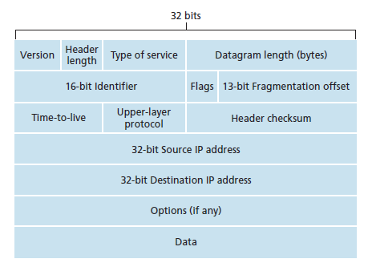
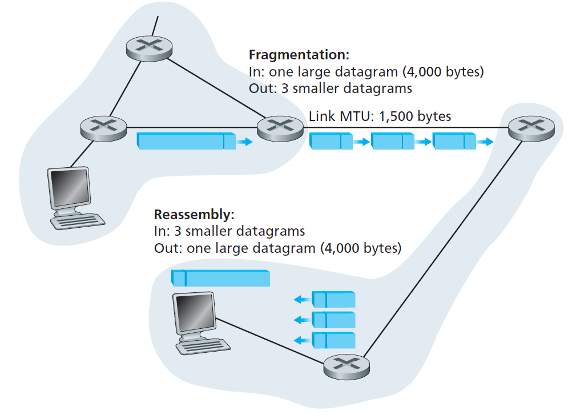
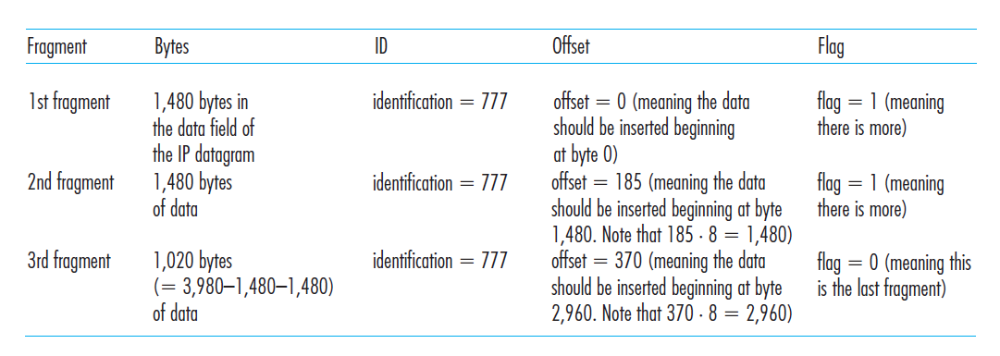

## Network Layer

Network layer has three major components:
- **IP protocol**
- **Routing Component**
- **facility to report errors in datagrams and respond to requests for certain network-layer information**


### IP datagram format


- Version number. These 4 bits specify the IP protocol version of the datagram
- Header length. Because an IPv4 datagram can contain a variable number of
options (which are included in the IPv4 datagram header), these 4 bits are needed
to determine where in the IP datagram the data actually begins.
- Type of service. The type of service (TOS) bits were included in the IPv4 header
to allow different types of IP datagrams (for example, datagrams particularly
requiring low delay, high throughput, or reliability) to be distinguished from each
other.
- Datagram length. This is the total length of the IP datagram (header plus data),
measured in bytes.
- Identifier, flags, fragmentation offset. These three fields have to do with so-called
IP fragmentation.
- Time-to-live. The time-to-live (TTL) field is included to ensure that datagrams
do not circulate forever (due to, for example, a long-lived routing loop) in the
network. This field is decremented by one each time the datagram is processed
by a router. If the TTL field reaches 0, the datagram must be dropped.
- Protocol. This field is used only when an IP datagram reaches its final destination.
The value of this field indicates the specific transport-layer protocol to
which the data portion of this IP datagram should be passed.
- Header checksum. The header checksum aids a router in detecting bit errors in a
received IP datagram.
- Source and destination IP addresses.
- Options. The options fields allow an IP header to be extended.
- Data (payload). In most circumstances, the data
field of the IP datagram contains the transport-layer segment (TCP or UDP) to
be delivered to the destination.

Note that an IP datagram has a total of 20 bytes of header (assuming no options). If
the datagram carries a TCP segment, then each (nonfragmented) datagram carries a
total of 40 bytes of header (20 bytes of IP header plus 20 bytes of TCP header) along
with the application-layer message.

### IP Datagram Fragmentation
```Not all link-layer protocols can carry network-layer packets of the same size.```

For example, Ethernet frames can carry up to 1,500
bytes of data, whereas frames for some wide-area links can carry no more than 576
bytes. The maximum amount of data that a link-layer frame can carry is called the
***maximum transmission unit (MTU)***. Because each IP datagram is encapsulated
within the link-layer frame for transport from one router to the next router, the MTU
of the link-layer protocol places a hard limit on the length of an IP datagram.

The solution is to fragment the data in the IP datagram into two or more smaller IP
datagrams, encapsulate each of these smaller IP datagrams in a separate link-layer
frame; and send these frames over the outgoing link. Each of these smaller datagrams
is referred to as a ***fragment***.

Fragments need to be reassembled before they reach the transport layer at the destination.
Indeed, both TCP and UDP are expecting to receive complete, unfragmented
segments from the network layer. Designers of IPv4 decided to put the job
of datagram reassembly in the end systems rather than in network routers.

To allow the destination host to
perform these reassembly tasks, the designers of IP (version 4) put identification,
flag, and fragmentation offset fields in the IP datagram header.

For example, A datagram of 4,000 bytes (20 bytes of IP
header plus 3,980 bytes of IP payload) arrives at a router and must be forwarded to
a link with an MTU of 1,500 bytes. This implies that the 3,980 data bytes in the
original datagram must be allocated to three separate fragments (each of which is
also an IP datagram):



Here is the packet format for each fragment:



